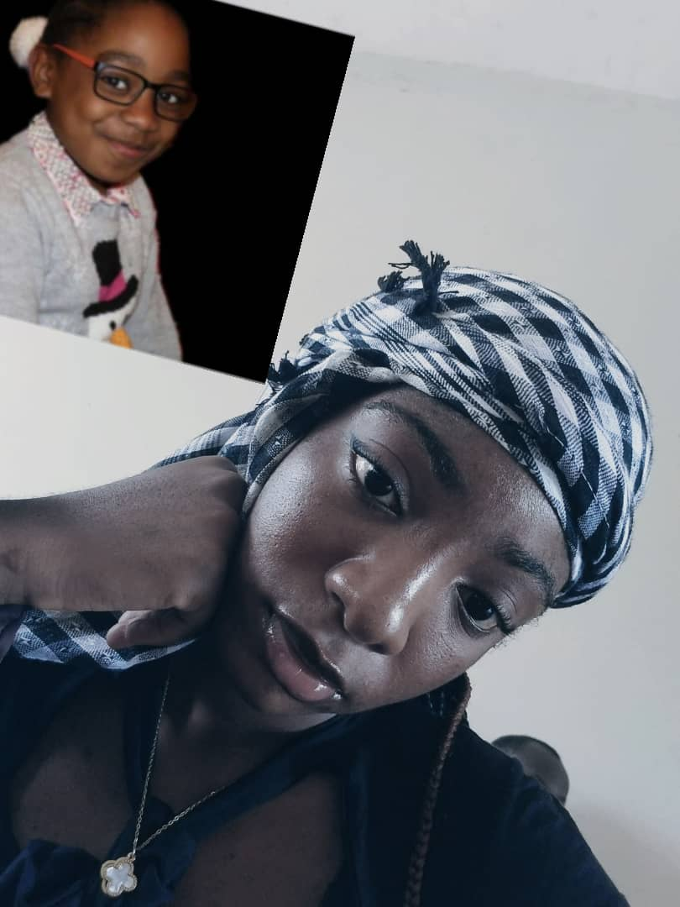
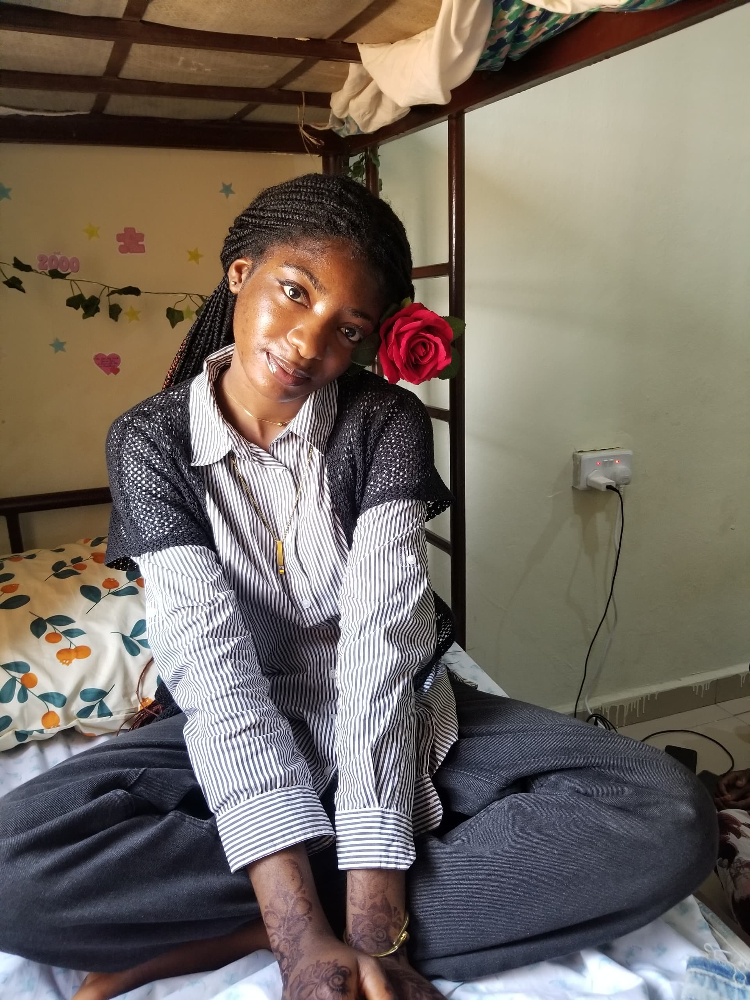
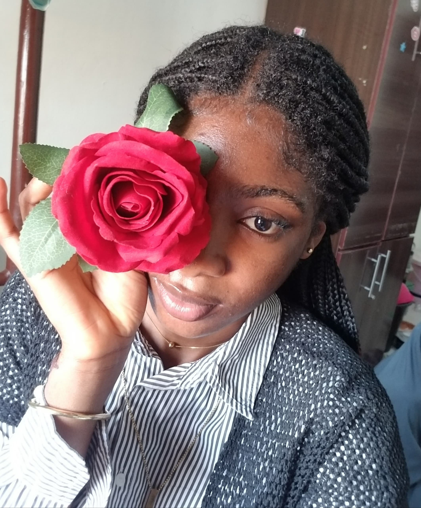

<html lang="en">
<head>
  <meta charset="UTF-8"/>
  <meta name="viewport" content="width=device-width, initial-scale=1.0"/>
  <title>For My Empress 👑</title>
  <link rel="preconnect" href="https://fonts.googleapis.com">
  <link rel="preconnect" href="https://fonts.gstatic.com" crossorigin>
  <link href="https://fonts.googleapis.com/css2?family=Cormorant+Garamond:ital,wght@0,300;0,400;1,300;1,400&family=Quicksand:wght@300;400;500&display=swap" rel="stylesheet" />
  
</head>
<body class="no-scroll">

  
A universe built for you...

<section id="s0">
  

    
    

    <a href="#s1" class="next-btn">Start →</a>
  

</section>

<section id="s1">
  

    
    

    <a href="#s2" class="next-btn">Next →</a>
  

</section>

<section id="s2">
  

    
    

    <a href="#s3" class="next-btn">Next →</a>
  

</section>

<section id="s3">
  

    
    

    <a href="#s4" class="next-btn">Next →</a>
  

</section>

<section id="s4">
  

    
    

    <a href="#s5" class="next-btn">Next →</a>
  

</section>

<section id="s5">
  

    
    

    <a href="#s6" class="next-btn">Next →</a>
  

</section>

<section id="s6">
  

    
    

    <a href="#s7" class="next-btn">Next →</a>
  

</section>

<section id="s7">
  

    
    

    <a href="#s8" class="next-btn">Final →</a>
  

</section>

<section id="s8">
  

    
    

    
With lots of love ❤ TeeJay

  

</section>

</body>
</html>
